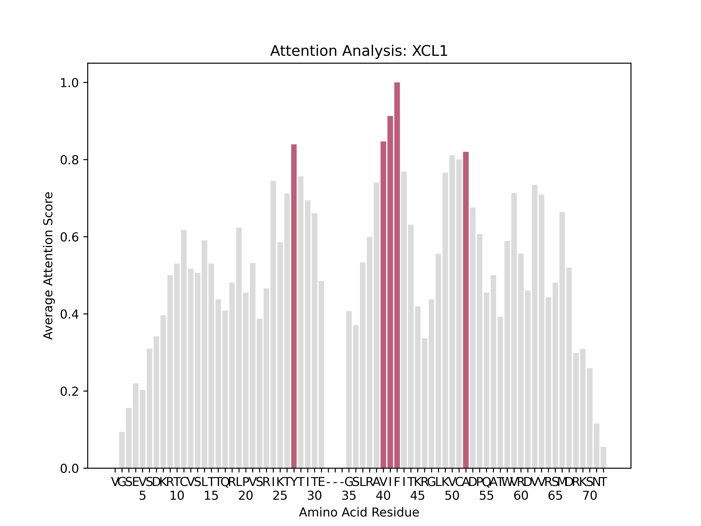
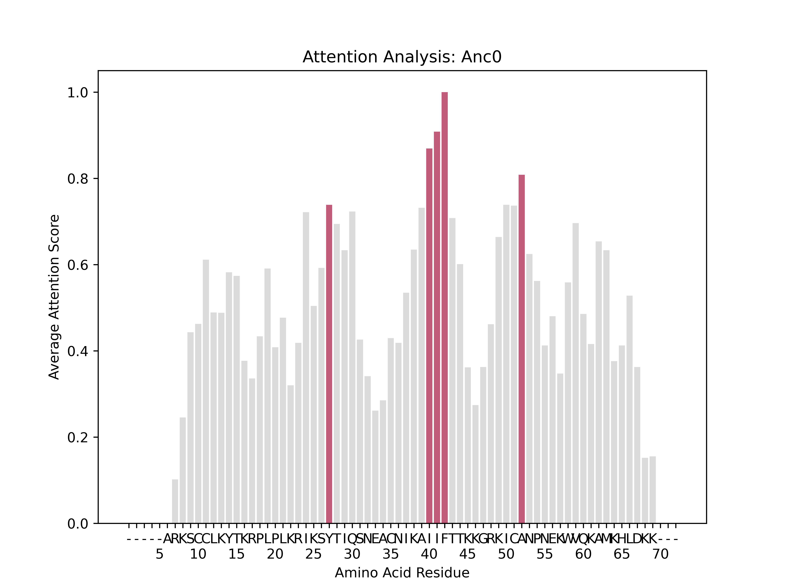
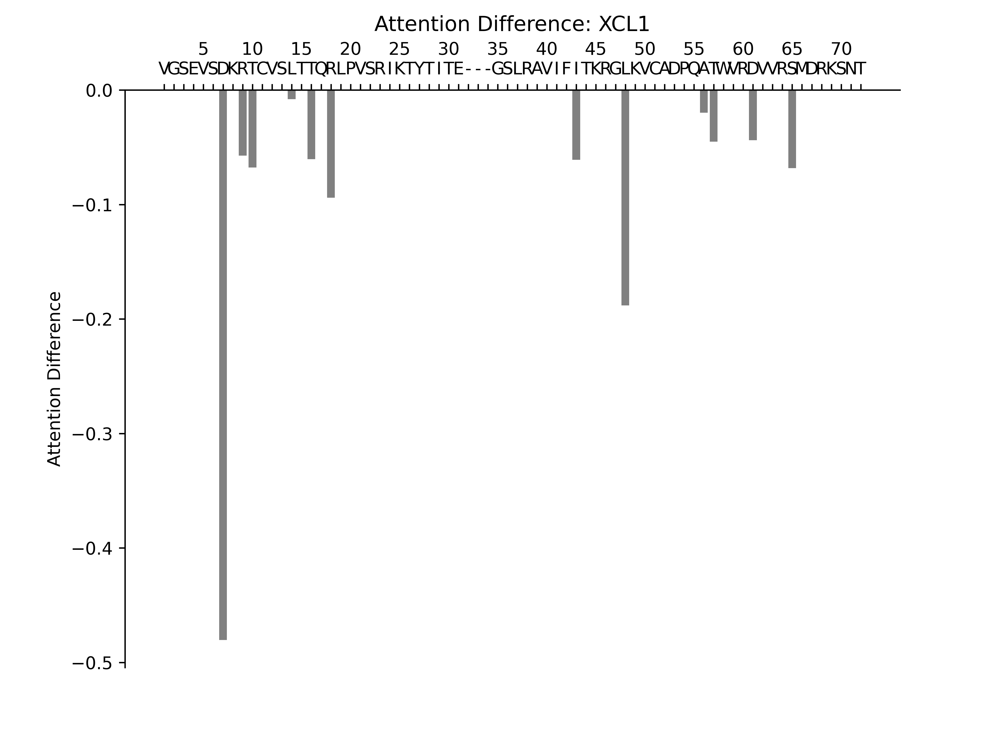
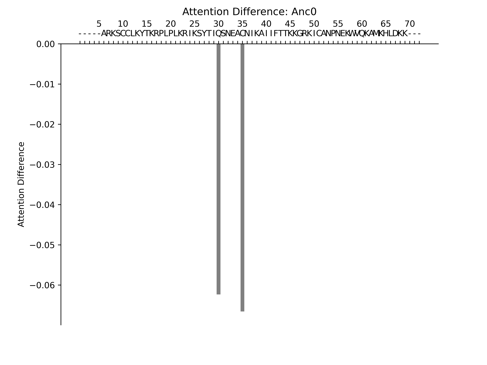
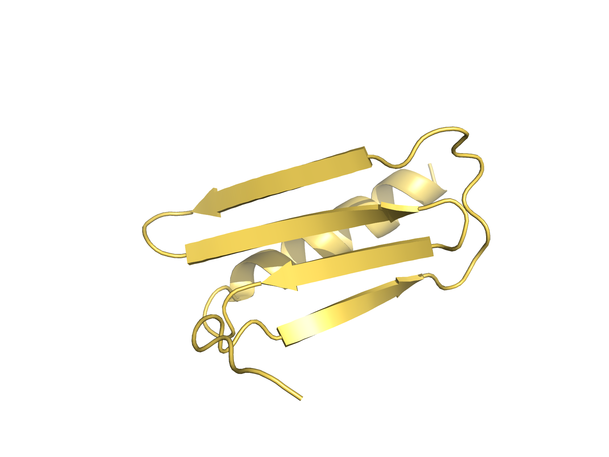

# XCL1 Example: End-to-End Pipeline

This example demonstrates a complete run of the E2E attention analysis pipeline using the human lymphotactin protein XCL1 (PDB ID 2jp1) and its ancestral reconstruction Anc0 (PDB ID 7JH1). This comparison reveals evolutionarily significant attention patterns that may correspond to functional divergence between the modern and ancestral proteins.

## Running the Pipeline

### Command
```bash
poetry run python3 scripts/run_e2e_pipeline.py \
  --query-seq-path examples/XCL1/xcl1_seq.fa \
  --query-name XCL1 \
  --target-name Anc0 \
  --target-seq-path examples/XCL1/anc0_seq.fa \
  --alignment-path examples/XCL1/xcl1_anc0.a3m
```

### Parameters Explained

- `--query-seq-path`: Path to the FASTA file containing the XCL1 sequence
- `--query-name`: Display name for the query protein (XCL1)
- `--target-name`: Display name for the target/reference protein (Anc0)
- `--target-seq-path`: Path to the FASTA file containing the Anc0 ancestral sequence
- `--alignment-path`: Path to the multiple sequence alignment file to align amino acids

Note: Requires GPU usage

## Sequences

### Raw Sequences
Used for structure prediction. These must not contain gaps or dashes.

XCL1
```bash
>xcl1
VGSEVSDKRTCVSLTTQRLPVSRIKTYTITEGSLRAVIFITKRGLKVCADPQATWVRDVVRSMDRKSNT
```

ANC0
```bash
>anc0
ARKSCCLKYTKRPLPLKRIKSYTIQSNEACNIKAIIFTTKKGRKICANPNEKWVQKAMKHLDKK
```

Alignment

The gaps (-) define the residue-to-residue mapping.
```bash
>xcl1
VGSEVSDKRTCVSLTTQRLPVSRIKTYTITE---GSLRAVIFITKRGLKVCADPQATWVRDVVRSMDRKSNT
>anc0
-----ARKSCCLKYTKRPLPLKRIKSYTIQSNEACNIKAIIFTTKKGRKICANPNEKWVQKAMKHLDKK---
```

## Results

The pipeline generates several output visualizations that provide complementary views of the attention landscape.

### Average Attention Maps

Average attention maps show the mean attention weights across all attention heads and layers for each position in the sequence. These maps reveal which residues the model considers most important globally.

#### XCL1 Average Attention



This heatmap displays the average attention pattern for the modern XCL1 protein. Colored bars indicate amino acids that receive the highest attention, suggesting importance for AF2 folding. 

#### Anc0 Average Attention



Anc0's average attention patterns reveals important amino acids to AF2 for a different fold for a related protein.  

### Attention Difference Maps

The attention difference map is the **core analytical output** of this pipeline. It computes the element-wise difference between two folds to see what is important to AF2 for each.

**Calculation**: `Difference = +(Attention(XCL1) - Attention(Anc0)) * -(BLOSUM62 scores)`

This subtraction highlights where attention patterns differ significantly.

#### XCL1 Attention Difference (Query Perspective)



#### Anc0 Attention Difference (Target Perspective)




## Structures

The following models represent the Rank 1 structures (highest confidence) generated by AlphaFold2.

XCL1


ANC0
